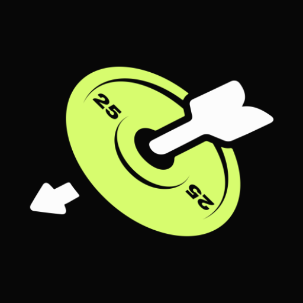
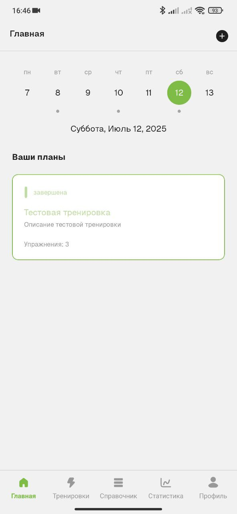
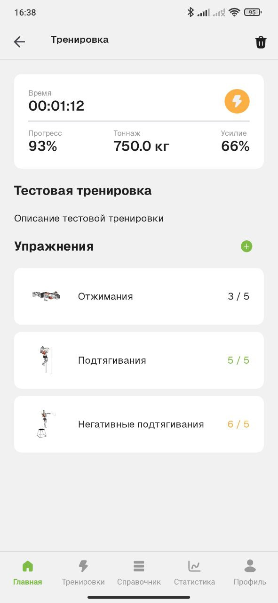
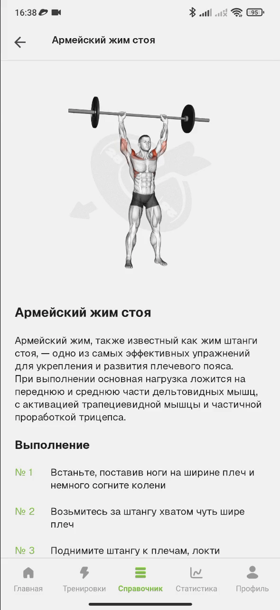

# IntroGym 

**IntroGym** is an Android fitness app created for beginners. It helps you plan your workouts, track your progress, and lower the barrier to entry into the world of physical activity.

## Screenshots

  
  
  

## Technologies and Architecture
- **MVVM** – Model-View-ViewModel pattern for UI separation
- **Clean Architecture** – Layered project structure for maintainability and scalability
- **Kotlin** – Main programming language
- **Android View** – Classic UI layout system (XML-based)
- **Navigation Component** – Manages navigation and screen transitions 
- **Kotlin Coroutines** – Asynchronous programming support
- **Kotlin Flow** – Reactive streams for data handling
- **Glide** – Image loading and caching
- **Room** – Local database
- **Koin** – Dependency injection
- **MPAndroidChart** – Charts and data visualization
- **FlexboxLayout** – Flexible UI layout container
- **JUnit5, MockK** – Unit testing and mocking
- ~~**Gson** – JSON serialization/deserialization~~
- ~~**Retrofit2** – REST API networking client~~

Note: Gson and Retrofit2 were used during development but were removed in the release version.

## Platforms

The app is available for download on [RuStore](https://www.rustore.ru/catalog/app/ru.lonelywh1te.introgym)  
